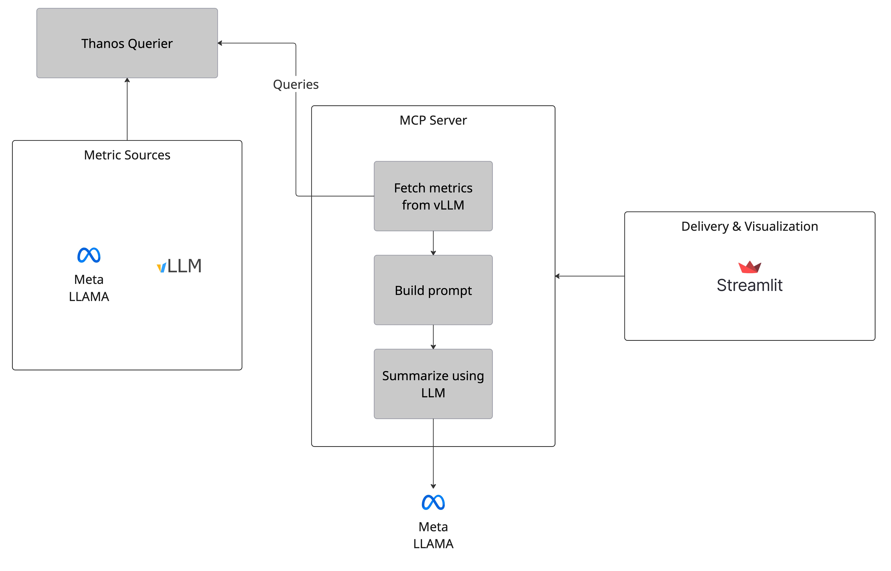
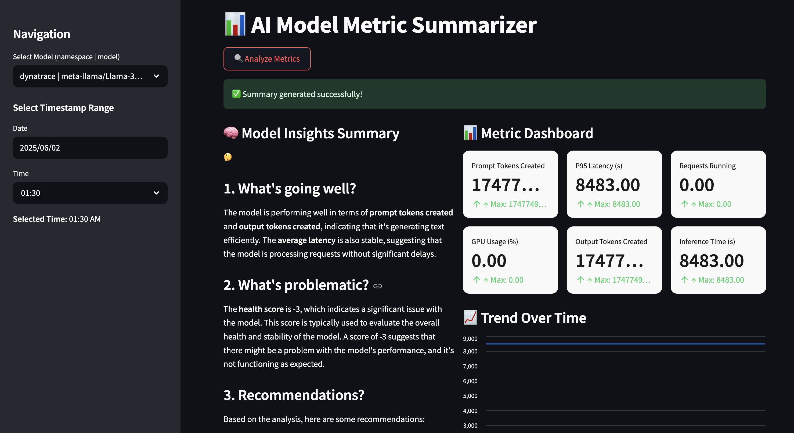

# AI Observability Metrics Summarizer

[Design Document](https://docs.google.com/document/d/1bXBCL4fbPlRqQxwhGX1p12CS_E6-9oOyFnYSpbQskyI/edit?usp=sharing)

This application provides an interactive dashboard and chatbot interface to **analyze AI model performance metrics** collected from Prometheus and generate **human-like summaries using a Llama model** deployed on OpenShift AI.

It helps teams **understand what’s going well, what’s going wrong**, and receive **actionable recommendations** on their vLLM deployments — all automatically.

---

## Features

- Visualize core vLLM metrics (GPU usage, latency, request volume, etc.)
- Generate summaries using a fine-tuned Llama model
- Chat with an MLOps assistant based on real metrics
- Fully configurable via environment variables and Helm-based deployment

---

## Architecture

- **Prometheus**: Collects and exposes AI model metrics
- **Streamlit App**: Renders dashboard, handles summarization and chat
- **LLM (Llama 3.x)**: Deployed on OpenShift AI and queried via `/v1/completions` API



---

## Prerequisites

- OpenShift cluster
- `oc` CLI configured
- Installed `yq`

---

## Installation

Use the included `Makefile` to install everything:

```bash
brew install yq
```

```bash
cd deploy/helm
```

If you want single model deployment -

```bash
make install NAMESPACE=metric-summarizer LLM=llama-3-2-3b-instruct LLM_TOLERATION="nvidia.com/gpu"
```

If you want multiple model deployments -

```bash
make install NAMESPACE=llama-stack-summarizer LLM=llama-3-2-3b-instruct LLM_TOLERATION="nvidia.com/gpu" SAFETY=llama-guard-3-8b SAFETY_TOLERATION="nvidia.com/gpu"
```

To run and install the full environment, including the extended multi-model support -

```bash
make install NAMESPACE=$NAMESPACE
```

This will:

1. Deploy Prometheus
2. Deploy Llama models - single or multiple models
3. Extract their URLs
4. Create a ConfigMap with available models
5. Deploy the Streamlit dashboard connected to the LLM

Navigate to your **Openshift Cluster --> Networking --> Route** and you should be able to see the route for your application.

On terminal you can access the route with -

```bash
oc get route

NAME              HOST/PORT                                                               PATH   SERVICES        PORT   TERMINATION     WILDCARD
metric-ui-route   metric-ui-route-llama-1.apps.tsisodia-spark.2vn8.p1.openshiftapps.com          metric-ui-svc   8501   edge/Redirect   None
```



To uninstall:

```bash
make uninstall NAMESPACE=metric-summarizer
```

---

## Using the App

1. Open the route exposed by the `metric-ui` Helm chart (e.g., `https://metrics-ui.apps.cluster.local`)
2. Select the AI model whose metrics you want to analyze
3. Click **Analyze Metrics** to generate a summary
4. Use the **Chat Assistant** tab to ask follow-up questions

---

## Powered By

- [OpenShift AI](https://www.redhat.com/en/technologies/cloud-computing/openshift/openshift-ai)
- [Prometheus](https://prometheus.io/)
- [Streamlit](https://streamlit.io/)

---

## Feedback & Contributions

We welcome contributions and feedback!  
Please open issues or submit PRs to improve this dashboard or expand model compatibility.

---
